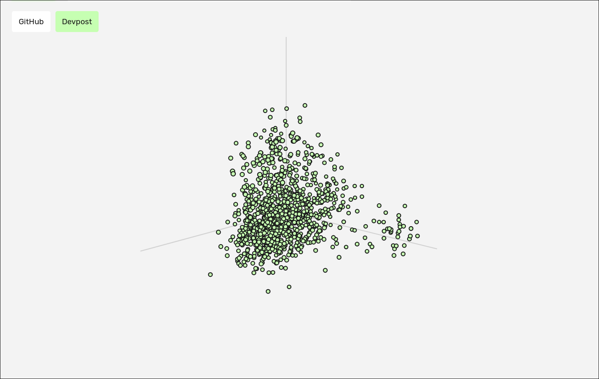

# Embedding Explorer

Implementation of Hugging Face's AutoModel to load open models and create vector databases of popular online repositories and visualize them in 3D w/ PCA.

Currently, "scripts/setup.sh", pulls in gemma3 (300M) as the encoder model of choice.

Implemented at: gaddielwb.com/projects/embedding-explorer

## Set up (Mac/Linux)

### Building

```bash
# Clone repo
git clone https://github.com/gxddi/embedding-explorer
cd embedding-explorer

# GitHub token for fetch (keep this shell open when running the app)
export GITHUB_TOKEN='your-github-token'

# Setup dependencies
./scripts/setup.sh

mkdir build | cd build
cmake -S ../ -B ./
# build binary of choice
make
```

Requirements:
- git
- cmake
- make
- pip (for setup script)
- cjson
- curl
- openssl

### Guide
TBA

## Motivations
Originally created to index GitHub and DevPost to find projects similar to the ones I was working on but realized that this is pretty much just Exa. 

## Contributions

### AI Contributions
- Heavy contributions to the devpost version of the fetch program

---

#### Made with 🧠


