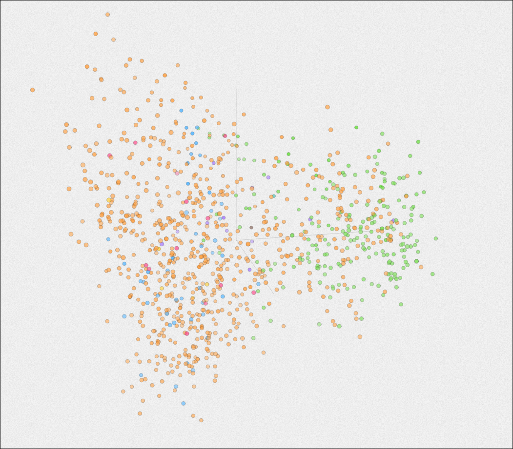

# Embedding Explorer

Implementation of Hugging Face's AutoModel to load open embedding models and create vector databases of popular online datasets of personal interest (e.g. Top Github repos, Devpost submissions to hackathons of interest) and visualize them in 3D w/ PCA.

Currently the implementation at [gaddielwb.com/projects/embedding-explorer](https://gaddielwb.com/projects/embedding-explorer) pulls in and runs EmbeddingGemma3 (300M) as the encoder-transformer model of choice.

## Set up (Mac/Linux)

### Building

```bash
# Clone repo
git clone https://github.com/gxddi/embedding-explorer
cd embedding-explorer

# GitHub token for fetch (keep this shell open when running the app)
export GITHUB_TOKEN='your-github-token'

# Setup dependencies
./scripts/setup.sh

mkdir build | cd build
cmake -S ../ -B ./
# build binary of choice
make
```

Requirements:
- git
- cmake
- make
- pip (for setup script)
- cjson
- curl
- openssl

### Guide
TBA

## Motivations
Originally created to index GitHub and DevPost to find projects similar to the ones I was working on but realized that this is pretty much just [Exa](https://exa.ai/). 

## Contributions

### AI Contributions
- Heavy contributions to the devpost implementation of fetch/
- Heavy contributions to the actual server, adapted from some of my [boilerplate](https://github.com/gxddi/boilerplate/tree/main/website-stack)

---

#### Made with 🧠


